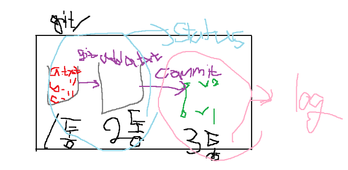

# 2회차 수업

## 오늘의 학습목표

> `마크다운` 기반 문서를 작성할 수 있고, Git으로 관리할 수 있다.

> `CLI`와 `GUI` 환경의 `차이점을 비교`할 수 있다.

> `버전관리의 의미`를 이해하고 버전관리도구의 종류를 설명할 수 있다.

> `CLI환경`에서 `기초 파일시스템 조작`을 할 수 있다.

### 12.27

- 화~목 : Git/GitHub 오전,오후 풀 수업

- git : 소스코드를 관리할 수 있는 도구
- github: git 을 온라인으로 관리하는 도구?
- github에서 개발한 흔적을 남길 수 있다.
깃허브에는 매일 출석체크를 할 수 있다. 나도 `꾸준히` 출석기록을 남기는 사람이 되자!

## <목차>
1. Markdown을 활용한 문서작성
- 개발자로써 문서작성을 어떻게 해나갈지 생각하기
2. Git을 활용한 버전 관리
- 버전 관리 기본
- Git branch
3. Git Hub을 활용한 포트폴리오 관리 및 개발 프로젝트 시나리오
- 개인 포트폴리오 관리
    - TIL(Today I Learned)
    - 개인 개발 프로젝트
- 프로젝트 (협업)
    - GitHub Flow를 활용한 개발 프로젝트 가이드라인
        - Shared repository model/ Fork & Pull model

## 마크다운 기반 문서 작성
- 2004년에 존 그루버가 만든 텍스트 기반의 마크업 언어
- 마크업 언어란? 웹문서, 웹페이지를 만들 때 사용하는 언어
- HTML의 뒤 두글자 (Markup Language)
- 문서의 구조화 
- 마크다운 특징: 워드프로세서(한글/MS word)는 다양한 서식과 구조를 지원하지만 다른 프로그램으로 호환에 제약이 됨
- 예전에는 워드프로세서 간 이동을 하면 호환성에 문제가 생겨서 서식과 구조에 변경이 생기는 경우가 많았음
- 현재 웹페이지나 다른 도구에서 변환이 되서 보여짐
- README.md: md는 마크다운의 확장자, 오픈소스의 공식문서를 작성하거나 개인 프로젝트의 프로젝트 소개서로 활용
- 정적사이트 생성기: Jekyll(예전에 많이 사용하던거), Gatsby(요즘) 등으로 작성된 마크다운을 HTML, CSS, JS 파일 등으로 변환
- 마크다운 기반 SW: Jupyter notebook에는 별도의 마크다운 셀로 프로젝트 내용과 분석 결과를 정리 가능함, Notion과 같은 메모/노트 필기 SW역시 마크다운 기반 문서 작성을 기본으로 함

## **`마크다운의 문법`**
- 문서에 어떠한 모습이 담겨있는지: 구조도, 정렬된 모습
소제목, 링크, 표, 이상한 문단, 목록 등등...

### 1. Heading: 문서의 제목이나 소제목
- `#`의 개수에 따라 대응되는 수준이 있음 (h1~h6으로 표현)
- 문서의 구조를 위해 작성되며 글자 크기를 조절하기 위해 사용되어서는 안됨!
- 예시) #서론 (##개요, 배경(###국내, 국외), 목적)- #본론(##1,2,3,,,) - #결론 (##결론, 제안)
- 마크다운 문법: # 보고서 (ㅇ) #보고서 (x), 띄어쓰기 잘하자

### 2. LIst: 목록
- 순서가 있는 리스트(ol)과 순서가 없는 리스트(ul)로 구성
* ol은 숫자로 쓰고, ul은 `-`(하이픈)이나 `*`(애스터리스크)
- `Tab`으로 하위 항목을 구성할 수 있음
- 목록 내에서 계층관계를 표현할 수 있음
- 예시)
    1. HTML
    2. CSS
    3. JavaScript
    4. Python

### 3. Fenced Code block: 코드 블록
- 코드 블록은 backtick(`) 기호 3개를 활용하여 작성(```)
- 예시) 
```python 
print("Hello")
# 주석
```
```html
# 주석이 아니죠
<!-- 주석 -->
```

### 4. Inline Code block: 인라인 코드 블록 
- 코드 블록은 backtick 기호 1개를 인라인에 활용하여 작성(`)
- 예시) 마크다운은 `마크업 언어` 입니다.


### 5. Link: 링크
- [문자열]`괄호`url`괄호`의 방식으로 작성 
- 예시) 
    - [구글](https://google.com)
    - [a 파일](./a.md) .지금 폴더 (디렉토리)
    - [b 폴더](b/)
    - [b 폴더 b.txt](b/b.txt)                 
    - [문자열](url)을 통해 링크 작성 가능

### 6. Image: 이미지
- !문자열을 (url)을 통해 이미지를 사용가능
- 특정 파일들 포함하여 연결시킬 수도 있음
- [] 안에 이름이 없어도 됨
- 예시) 

  

  


### 7. Blockquotes: 인용문
- (>)으로 인용문을 작성
- 예시) 
>중요한 것은 꺾이지 않는 마음

### 8. 테이블
- 표

- 
    |Name|Goals|
    |-|-|
    |Kylian Mbappe|8|

### 9. 텍스트 강조
- `*`굵게(bold), `**`기울임(Italic)을 통해 특정 글자들을 강조
- 예시) *중꺾마* *Italic* **중꺾마** **bold**

### 10. 취소선
 ~~로 취소선 작성
- 예시) ~~마음~~

### 11. 기타
- Notion 도 heading 과 List 로 이루어져 있음
- 마크다운 가이드 사이트
https://www.markdownguide.org/

- 레벨2 개발자
    - 개발도구의 공식 레퍼런스를 보고 사용법을 스스로 익힐 수 있음
    - 자신이 경험한 사용법을 `문서화`해서 팀 내에 `전파`할 수 있음
- DR(Developer Relations) 직무
- Technical writing conference: Clova 기술 문서 작성 및 관리업무

## CLI
- CLI 는 `명령어 인터페이스`이다. 가상 터미널 또는 텍스트 터미널을 통해 `사용자와 컴퓨터가 상호 작용하는 방식`을 뜻한다.
- 명령어 기반의 줄단위 인터페이스
    - mac : 터미널
    - 윈도우: 파워쉘, cmd

- GUI와 CLI 차이
    - GUI는 그래픽으로 유저에게 인터페이스를 제공하는 것
    - CLI는 명령어로 컴퓨터에게 명령하는 곳

Interface가 다르다고 불편하게 생각하지말고,
'전혀 다르게' 생각하고 조작하자.

- CLI에서 중요한 점: 내가 어느 폴더를 열었는지 제일 먼저 확인하자
- 기초 파일시스템 명령어
    - mkdir : 디렉토리 생성(make directory)
    - ls : 목록(list)
    - cd : 디렉토리 이동(change directory)
    - cd .. : 상위 디렉토리로 이동
    - touch : touch 파일명 : 새로운 파일을 생성
    - rm 파일명 : 파일 삭제(remove)

## 버전 관리의 의미
- git: 분산 버전 관리 시스템
- 리눅스 토르발스: 리눅스를 만든 사람, git도 만들었음

- 크로미움(크롬 브라우저의 오픈소스)
- 최신 버전의 용량 1.58GB, 현재까지의 1,000,000여개의 커밋 20,000개의 릴리즈지만 총 25GB정도
- 커밋단위로 버전 업데이트 현황을 알 수 있다.
- 차이(diff)와 수정 이유를 메시지로 남길 수 있다.
- Google Document: 문서는 하나지만 버전이 기록되어 있으면, 이전 시점을 조회하거나 복원시킬 수도 있음

## Git 기초 흐름
- 분산버전관리시스템으로 코드의 버전을 관리하는 도구
- 컴퓨터 파일의 변경사항을 추적하고 여러 명의 사용자들 간에 파일들의 작업을 조율

- 분산버전관리시스템(DVCS)
    - 중앙집중식버전관리시스템
    - 분산버전관리시스템 -> git : 로컬에서도 버전을 기록하고 관리, 원격저장소를 활용하여 협업

- **Git 버전관리 흐름**
1. **`작업을 하고 - Working Directory(1통), status`**
2. **`변경된 파일을 모아 - Stagging Area (2통, add), status`**
3. **`버전으로 남긴다. - Repository (3통, commit), log`**

- (1통): Untracked files : 트래킹 되지 않은 파일들<br>
(상황) 1.txt를 만들었지만, add를 하지 않음
<br>
- (2통): Changes to be committed: 커밋될 변경사항들
(상황) 보고서.txt만들고 add한 상태
1. `Working Direcatory` : 파일의 변경사항
2. `Staging Area` : 버전으로 기록하기 위한 파일 변경사항의 목록
3. `Repository` : 커밋(버전)들이 기록되는 곳


~~설명을 돕는 사진~~

- -$ git add <file>
- -$ git commit -m '<커밋메시지>' :  staged 상태의 파일들을 커밋을 통해 버전으로 기록, 변경사항을 나타낼 수 있도록 명확하게 작성해야 함
- **`변경사항이 생겼을 때 기록하고 싶으면 add, commit 을 하는 것임`**

- -$ git log -1 : 최근 1개
- -$ git log --oneline : 한 줄로
- -$ git log -2 --oneline : 최근 2개를 한 줄로

- -$ git status


- git commit -m '보고서 초안 작성'
- nothing to commit, working tree clean => 1통, 2통 비어있음!


### **Status로 확인할 수 있는 파일의 상태**
- Tracked : 이전부터 버전으로 관리되고 있는 파일
    - Unmodified : git status에 나타나지 않음 (X)
    - Modified : Changes not staged for commit (1통)
    - Staged : Changes to be committed (2통)
- Untracked : 버전으로 관리된 적 없는 파일 (파일을 새로 만든 경우) (1통)

- |명령어|내용|
  |--|--|
  |git init|로컬저장소 생성|
  |git add <파일명>|특정 파일/폴더의 변경사항 추가|
  |git commit -m '<커밋메시지>'|커밋 (버전 기록)|
  |git status|상태 확인|
  |git log|버전 확인|
