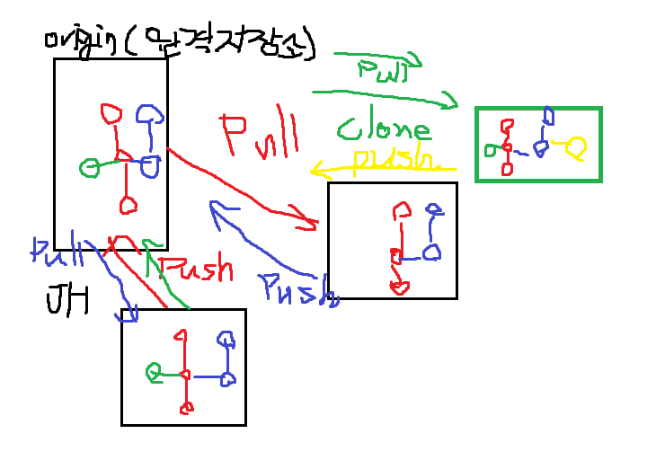
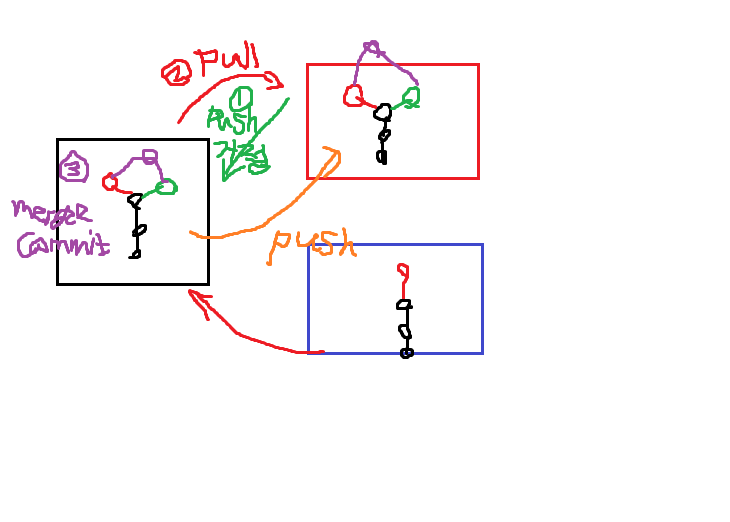

# 3회차 수업

## 학습목표
> `원격저장소 활용 명령어`를 이해하고 설명할 수 있다.

> `분산버전관리시스템`을 이해하고 설명할 수 있다.

> `GitHub 원격저장소`에 `로컬 저장소`를 올려 관리할 수 있다.

### 12.28
- 모르는 것과 어려운 것을 잘 구분하자!
- 메모장은 인코딩의 적, 무조건 나중에 글씨가 깨지므로 vscode로 만들자!
## <복습>
- git = 분산버전관리시스템
- 분산버전관리시스템 = local에서도 버전을 만들어서 관리할 수 있다
- local 버전 관리 : 작업을 (add) commit
- 파일로 할 수 있는 작업:  생성, 수정, 삭제
- **CRUD: create, read, update, delete**
- 커밋해시값: 고유한 커밋인지를 분류하는 도구
- (Head -> master): 어느 작업 흐름에 있는지 알려줌

## 분산버전관리시스템
- 로컬에서도 버전을 기록하고 관리하고 있다.
내 버전을 공유하고 관리해서 다른사람들이 참여할 수 있도록 함
- github: 90%의 기업들이 opensource를 사용하고 있다.

## 깃허브에 저장하는 법
- $ git remote add origin https://github.com/ParkJiHwan22/Test_1.g_1.git 
- (해석) 깃아 원격저장소 추가해 오리진으로  url을
- 원격저장소 기본 이름 많이 쓰는 것 -> origin

## **`Push` : 로컬 저장소의 버전을 원격 저장소로 보낸다.**
- $ git push <원격저장소이름><브랜치이름>
- $ git push origin master

## **`Pull` : 원격 저장소의 버전을 로컬 저장소로 가져온다.**
- $ git pull <원격저장소 이름><브랜치 이름>
- $ git pull origin master

~~이해를 돕는 그림1~~

## GitHub
- 깃허브에는 commit(3통)이 올라가는 것임.
- 깃허브에는 파일이 올라가는게 아니라 `버전이 올라가는 것`임.

- 로컬저장소의 버전을 원격 저장소로 PULL하기
 GitHub에 파일을 추가하고 싶으면 새로운 버전을(커밋) 만들 것
- GitHub에 올리고 로컬에서 파일을 지우면 사라지지는 않음
- `최신 버전의 상태를 보여줄 뿐`이다, 구글드라이브가 아님

- 어떤 프로젝트를 받아올 때는 `clone`에서 받아가야 함
- $ git clone url  : 원격 저장소 복제
- 로컬에서 새로운 프로젝트의 시작? git init
- 원격에 있는 프로젝트의 시작? git clone
## 명령어 정리
- |명령어      |내용          |
  |-----------|---------------|
  |git clone url|원격 저장소 복제     |
  |git remote -v|원격 저장소 정보 확인|
  |git remote add <원격저장소> <url> | 원격 저장소 추가 (일반적으로 origin)|
  |git remote rm <원격저장소> | 원격 저장소 삭제|
  |git push <원격 저장소><브랜치> | 원격저장소에 push|
  |git pull <원격 저장소> <브랜치> | 원격저장소로부터 pull|
  |git init 해제 하는 법 | $ rm -rf .git|

## Push 실패
2. 원격 저장소의 커밋을 원격저장소로 가져와서(pull)
2. 로컬에서 두 커밋을 병합(추가 커밋 발생)
3. 다시 GitHub으로 push

~~이해를 돕는 그림2~~

- VS 코드 파일명 옆에 있는 것 (M, U)
    -  Untracked, Modified
- .gitignore : git 파일/폴더 등을 관리하지 않음, 미리 .gitignore 를 설정하자
- gitignore 파일

​https://gitignore.io/
- git 저장소마다 넣어서 사용하기