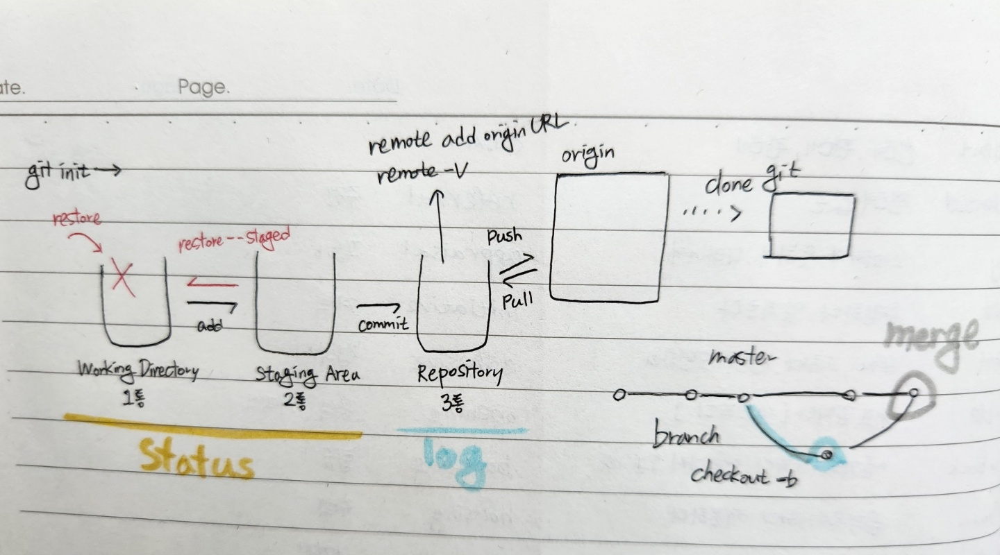

# 4회차 수업

## 학습목표
> `Branch의 목적`을 알고 활용할 수 있다.

> `Branch 병합 과정`의 상황을 `이해`하고 `충돌을 해결`할 수 있다.

### 12.29

## GitHub 꾸미는 법
1. 당일 주제에 맞춰서 이름 정하기
2. 파일에 나누어서 정리

## **`Branch`**
- 독립적인 작업흐름을 만들고 관리

## 브랜치 주요 명령어
- |명령어      |내용          |
  |-----------|---------------|
  |(master) git branch {branch name}|브랜치 생성     |
  |(master) git checkout|브랜치 이동|
  |(master) git checkout -b {branch name}| 브랜치 생성 및 이동|
  |(master) git branch |브랜치 목록|
  |(master) git branch -d {branch name}| 브랜치 삭제|
- checkout은 switch로 사용해도 됨

## **`Merge`**

- 각 branch에서 작업을 한 이후 이력을 합치기 위해 merge 명령어를 사용
- 병합을 진행할 때, `서로 다른 이력(commit)`에서 
  - `동일한 파일을 수정`한 경우 `충돌`이 발생
    - 이 경우에는 반드시 직접 해당 파일을 확인하고 적절하게 수정
    - 수정한 이후에 직접 커밋 실행
  - 다른 파일을 수정한 경우
    - 충돌 없이 자동으로 Merge Commit이 생성됨

1. merge - fast foward
- 기존 master 브랜치에 변경사항이 없어 단순히 앞으로 이동
  1. feature-a branch 이동 후 commit
  2. master 별도 변경 없음
  3. master branch로 병합
2. merge - merge commit
- 기존 master 브랜치에 변경사항이 있어 병합 커밋 발생
  1. feature-a branch로 이동 후 commit
  2. master branch commit
  3. master branch로 병합

## Git flow
- Git을 활용하여 협업하는 흐름으로 branch를 활용하는 전략을 의미
- GitHub Flow는 각 서비스별 제안되는 흐름이 있으며, 변형되어 각자의 프로젝트/회사에서 활용

## GitHub Flow 기본 원칙

1. master branch는 반드시 배포 가능한 상태여야 한다.
2. fature branch는 각 기능의 의도를 알 수 있도록 작성한다.
3. Commit message는 매우 중요하며, 명확하게 작성한다.
4. Pull Request를 통해 협업을 진행한다.
5. 변경사항을 반영하고 싶다면, master branch에 병합한다.

~~이해를 돕는 그림~~

## GitHub Flow model
- Shared Repository Model
- Fork & Pull Model

### **`Shared Repository Model`**
- Shared Repository Model은 동일한 저장소를 공유하여 활용하는 방식
- 예시는 작업흐름을 master + feature 브랜치로 구성

1. 팀원 초대 및 저장소 Clone
  - collaborator에 등록되어야 해당 저장소에 대한 push 권한이 부여
  - 이메일이 아닌 저장소 주소 뒤에 /invitation을 붙여도 됨
  - Clone 이후 작업에 맞춘 작업 환경 설정을 마무리함

2. 브랜치에서 작업 및 GitHub Push
  - 작업은 항상 독립적인 feature branch에서 한다.
    - master branch는 항상 배포 가능한 상태를 유지하고, 기능 개발은 독립적인 branch에서 작업
    - feature branch는 이름을 생성할 때, 기능을 명시적으로 나타냄
    - **`작업시 항상 어떠한 branch에 있는지 확인!`**
  - Commit으로 작업의 이력(history)을 남긴다.
    - Commit은 다른 사람들이 내가 한 작업들을 확인할 수 있는 이력이며, 코드의 변화에 맞춰 실시한다.
    - Commit 메시지는 매우 중요하며, `일관된 형식`으로 해당 이력을 쉽게 파악할 수 있도록 작성한다.
  - 완성된 코드는 원격저장소에 push를 한다.
3. Pull Request 생성
  - Github에 들어가서 Pull Request 버튼을 누른다.
  - PR과 관련된 설정을 진행한 후 요청을 생성한다.
4. Review 및 Merge
  - 작성된 코드를 확인 후 병합
    - 코드 리뷰를 진행하고, 관리자의 판단아래 병합한다.
    - 병합(merge) 과정에서 충돌이 발생할 경우 해결 후 병합을 진행한다.
    - master branch로 병합의 경우 코드가 반드시 배포 가능한 상태여야 한다.

### **`Folk & Pull Model`**
- Folk & pull Model은 Repository에 Collaborator에 등록되지 않은 상태에서 진행
- Github 기반의 오픈소스 참여 과정에서 쓰이는 방식

1. Fork & Clone
  - Forking project repository
    - 원격저장소를 fork한다.
    - 내 저장소로 복제본을 가져옴으로써 로컬에서 작업 후 원격 저장소로 push할 수 있게 되는 것
  - Clone을 하고 각 작업에 맞춘 작업 환경 설정을 마무리한다.
    - `Clone시 반드시 본인 저장소인지 확인할 것`
  2. 브랜치에서 작업 및 GitHub Push
  - 작업은 항상 독립적인 feature branch에서 한다.
    - master branch는 항상 배포 가능한 상태를 유지하고, 기능 개발은 독립적인 branch에서 작업
    - feature branch는 이름을 생성할 때, 기능을 명시적으로 나타냄
    - **`작업시 항상 어떠한 branch에 있는지 확인!`**
  - Commit으로 작업의 이력(history)을 남긴다.
    - Commit은 다른 사람들이 내가 한 작업들을 확인할 수 있는 이력이며, 코드의 변화에 맞춰 실시한다.
    - Commit 메시지는 매우 중요하며, `일관된 형식`으로 해당 이력을 쉽게 파악할 수 있도록 작성한다.
  - 완성된 코드는 원격저장소에 push를 한다.
3. Pull Request 생성
  - Github에 들어가서 Pull Request 버튼을 누른다.
  - PR과 관련된 설정을 진행한 후 요청을 생성한다.
4. Review 및 Merge
  - 작성된 코드를 확인 후 병합
    - 코드 리뷰를 진행하고, 관리자의 판단아래 병합한다.
    - 병합(merge) 과정에서 충돌이 발생할 경우 해결 후 병합을 진행한다.
    - master branch로 병합의 경우 코드가 반드시 배포 가능한 상태여야 한다.