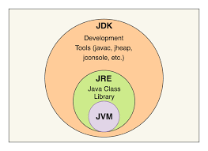

# Java 기본 문법

## 프로그램 (Program)
- 컴퓨터에서 실행될 때 특정 작업(specific task)을 수행하는 일련의 명령어들의 모음(집합)

## 운영체제 (Operating System, OS)
- 시스템 하드웨어를 관리할 뿐 아니라 응용 소프트웨어를 실행하기 위하여 하드웨어 추상화 플랫폼과 공통 시스템 서비스를 제공하는 시스템 소프트웨어

### 컴퓨터의 자료표현
- 비트 (Bit, Binary Digit) : 컴퓨터가 값을 저장하는 최소단위

- 바이트 (Byte) = 8 bits(256가지) -> 정보 처리의 최소 단위

- 10001001 -> -119 : 2의 보수
- 맨 앞에 1이 있는 경우 음수?
- 실제 값은 절댓값, 2의 보수를 취한 값

<2의 보수 구하는 법>
1. 비트를 서로 뒤집는다. -> 01110110
2. 1을 더해준다. -> 01110111
3. 계산하면 -119

- 자바 가상 머신(JVM, Java virtual machine)

- 자바 바이트코드를 실행할 수 있는 주체, write once, run everywhere!

- 컴파일: 프로그래밍 언어로 된 코드를 기계어로 바꾸는 과정

- 원래는 기계어로 바꾸어주는게 컴파일, 하지만 자바는 기계어가 아니라 Bytecode로 변환함, 다양한 운영체제나 기계에서 돌아가도록 설계되어있음

- 하드웨어, 제조사, OS에 따라 컴파일 방식이 다르다

- JVM : 바이트코드를 그 시스템 및 기계에 맞는 언어로 변환해주는 것, 각각의 시스템에 맞는 통역가

- Java는 플랫폼에 독립적, JVM은 플랫폼에 독립적이지 않음

- JDK : 자바 개발도구, 컴파일러가 들어있기 때문에 개발이 가능하다.

- JRE(runtime environment) : 자바 실행환경

<JVM, JDK, JRE의 관계>



### main method
- 실행 명령인 java 실행 시 가장 먼저 호출되는 부분

- 만약, Application에서 main()메소드가 없다면 절대로 실행될 수 없음

- Application의 시작 -> 특정 클래스의 main() 실행

## 변수와 자료형

### 변수
- 데이터를 저장할 메모리의 위치를 나타내는 이름
- 메모리 상에 데이터를 보관할 수 있는 공간을 확보
- 적절한 메모리 공간을 확보하기 위해서 변수의 타입 등장
- '='를 통해서 CPU에게 연산작업을 의뢰, 할당(메모리 위치에 값을 집어넣는다.)

### 메모리의 단위
- 0과 1을 표현하는 bit
- 8bit = 1byte

- 대소문자를 구분한다.
- 공백은 허용되지 않는다.
- 숫자로 시작할 수 없다.
- '$','_'를 변수이름에 사용할 수 있다. 이외의 특수문자는 허용하지 않는다.
- 예약어는 사용할 수 없다.
- 합성어의 경우 주로 camelCase를 활용한다.
- 한글을 이용한 변수 작명 가능(권장X)

### **`자료형`**
- 문자형
    - char -> 2byte, 기본값: null(\u0000)
- 정수형
    - byte -> 1byte, 기본값: (byte)0
    - short -> 2byte, 기본값: (short)0
    - int -> 4byte, 기본값: 0
    - long -> 4byte, 기본값: 0L

- 실수형
    - float -> 4byte, 기본값: 0.0f
    - double -> 8byte, 기본값: 0.0d

|타입|세부타입|데이터형|크기|기본값|값의 범위|
|--|--|--|--|--|--|
|논리형|--|boolean|--|false|true/false|
|문자형|--|char|2byte|null(\u0000)|0~65,535|
|숫자형|정수형|byte|1byte|(byte)0|-128~127|
|숫자형|정수형|short|2byte|(short)0|-32,768~32,767|
|숫자형|정수형|int|4byte|0|-2,147,483,648~2,147,483,647|
|숫자형|정수형|long|8byte|0L|-9...~9...|
|숫자형|실수형|float|4byte|0.0f||
|숫자형|실수형|double|8byte|0.0d||

### 변수와 자료형
- 선언: 자료형 변수명;
- 저장(할당): 변수명 = 저장할 값;
- 초기화: 자료형 변수명 = 저장할 값;

### **`형 변환(Type Casting)`**
- 자동(묵시적, 암묵적) 형변환이 가능한 방향
- byte -> short -> int -> long -> float -> double
- char -> int -> long -> float -> double

- **묵시적 형변환(Implicit Casting)**: 범위가 좁은 데이터 형에서 범위가 넓은 데이터 형으로 변경하는 것

- **명시적 형변환(Explicit Casting)**: 범위가 넓은 데이터 형에서 범위가 좁은 데이터 형으로 변경하는 것, 형 변환 연산자 사용

``` java
int i = 100;
byte b = (byte) i; // 명시적으로 써주어야 함, int > byte
```

## 연산자
- 증감 연산자 ++, --
    - 전위형(prefix) ++i : 먼저 값을 증가시키고 더함
    - 후위형(postfix) i++ : 먼저 값을 더하고 증가시킴

- 부호 연산자 +, -

- 논리 부정 연산자 !

- 비트 부정 연산자 ~

- 형 변환 연산자 (type)

- 산술 연산자
    - 곱하기 연산자 *
    - 나누기 연산자 /
    - 나머지 연산자 %
    - 더하기 연산자 +
    - 빼기 연산자 -

- **`정수와 정수의 연산 = 정수`**
- **`정수와 실수의 연산 = 실수`**

### 비교 연산자
- 대소 비교 연산
- 동등 비교 연산
- 객체 타입 비교 연산
    - instanceof

String 변수 비교
- **`equals() 사용`**

``` java
// 문자열은 어떻게 비교하는가?
String c=  "Hi";
String e = new String("Hi");

// 자바에서 문자열의 바교는 ==, != 연산자로 하지 않는다.
// 문자열에서 ==, != : 참조값(주소값) 비교
// 문자열에서 .equals : 값 비교
System.out.println(c.equals(e)); // ==
System.out.println(!c.equals(e)); // !=
```

### 논리 연산자
- && : 논리 곱(AND): 피연산자 모두가 true일 경우에만 true
- || : 논리 합(OR): 피연산자 중 하나라도 true일 경우 true
- ! : 논리 부정(NOT): 피연산자의 결과를 반대로 바꾼다.

## 제어문(조건문)

### if -else 문

``` java
if (조건식) {
    실행할 문장1;
    실행할 문장2;
} else if (조건식)  {
    실행할 문장a;
} else  {
    실행할 문장b;
}
```

### switch 문
- 인자로 선택변수를 받아 변수의 값에 따라서 실행문이 결정

``` java
switch(수식) {
    case 값1;
        실행문 A;
        break;

    case 값2;
        실행문 B;
        break;

    default:
        실행문 C;
}
```

- break 문 없이도 사용이 가능하다.
- dfault => else의 역할과 동일하다.

## 제어문(반복문)

### for 문

``` java
for (초기화식; 조건식; 증감식;) {
    반복 수행할 문장;
}
```

- 초기화는 반복문이 시작될 때 한 번 실행됨
- 조건식이 false이면, 반복문 종료
- 증감식은 반복문의 반복이 끝나면 실행됨
- 초기화식, 증감식은 (,)를 이용하여 둘 이상을 작성할 수 있음
- 필요하지 않은 부분은 생략할 수 있음, for(;;;)) 무한루프
- 반복횟수를 알고 있을 때 유용

### while 문

``` java
while (조건식) {
    반복 수행할 문장;
}
```

- 조건식이 true일 경우에 계속해서 반복(조건식이 거짓이 될 때까지 문장을 반복 수행)
- 조건식 생략 불가능

### do while 문

``` java
do {
    반복 수행할 문장;
} while 조건식;
```

- 블록 내용을 먼저 수행한 후 조건식 판단, 최소 한번은 수행
- 조건식이 true일 경우에 계속해서 반복(조건식이 거짓이 될 떄까지 문장을 반복 수행)
- 조건식 생략 불가능

### break

- switch, while, do-while, for 문의 블록에서 빠져나오기 위해서 사용
- 반복문에 이름(라벨)을 붙여 한번에 빠져나올 수 있음

### continue

- 반복문의 특정 지점에서 제어를 반복문의 처음으로 보냄
- 반복문에 이름(라벨)을 붙여 제어할 수 있음


## 자리 옮길 때 계정

- 자격증명관리자에서 계정 삭제
```
C:\Users\SSAFY\Desktop>git config --global user.email "bat522@naver.com"
C:\Users\SSAFY\Desktop>git config --global user.name "Jihwan Park"
```